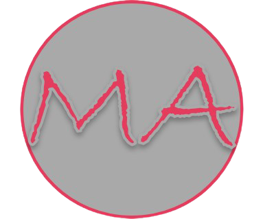

# Imagery

## Icons sourced from [Bootstrap Icons](https://icons.getbootstrap.com/)

**Home page**

Logo: created by myself using MS PowerPoint and [Remove BG](https://www.remove.bg/) to remove the background color.

Icons

* https://icons.getbootstrap.com/icons/person-circle/
* https://icons.getbootstrap.com/icons/basket3-fill/
* https://icons.getbootstrap.com/icons/people-fill/
* https://icons.getbootstrap.com/icons/signpost-split-fill/
* https://icons.getbootstrap.com/icons/cash-coin/
* https://icons.getbootstrap.com/icons/emoji-smile-fill/
* https://icons.getbootstrap.com/icons/pen-fill/
* https://icons.getbootstrap.com/icons/lightbulb-fill/
* https://icons.getbootstrap.com/icons/table/
* https://icons.getbootstrap.com/icons/watch/
* https://icons.getbootstrap.com/icons/cup-fill/

Images

[Sourced from Pixaby](https://pixabay.com/) Image by <a href="https://pixabay.com/photos/?utm_source=link-attribution&amp;utm_medium=referral&amp;utm_campaign=image&amp;utm_content=336378">Free-Photos</a> from <a href="https://pixabay.com/?utm_source=link-attribution&amp;utm_medium=referral&amp;utm_campaign=image&amp;utm_content=336378">Pixabay</a>

[Sourced from Pixaby](https://pixabay.com/) Image by <a href="https://pixabay.com/users/nietjuh-2218222/?utm_source=link-attribution&amp;utm_medium=referral&amp;utm_campaign=image&amp;utm_content=3076954">Ylanite Koppens</a> from <a href="https://pixabay.com/?utm_source=link-attribution&amp;utm_medium=referral&amp;utm_campaign=image&amp;utm_content=3076954">Pixabay</a>