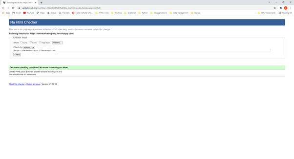
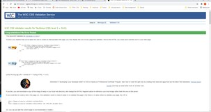

# Testing

Testing was done throughout site development, with branches created for each feature before it was merged into the master file.

Usability was tested with the below user acceptance testing, sent to new users to ensure testing from different users, on different devices and browsers to ensure issues were caught and where possible fixed during development.

|                                            | User Action                                                                              | Expected result                                                                                                        |   | Comment                                                         |
|--------------------------------------------|------------------------------------------------------------------------------------------|------------------------------------------------------------------------------------------------------------------------|---|-----------------------------------------------------------------|
| Sign Up                                    |                                                                                          |                                                                                                                        |   |                                                                 |
| 1                                          | Click on Register from navbar                                                            | Blank sign-up page                                                                                                     | Y |                                                                 |
| 2                                          | Enter new email address and username (https://tempail.com/en/ for a temp address)        | Field will only accept email address format                                                                            | Y |                                                                 |
| 3                                          | Enter new password                                                                       | Field will only accept secure passwords                                         | Y |                                                                 |
| 4                                          | Click Sign Up                                                                            | Takes user to confirm email page Sends address a confirmation request email                                            | Y |                                                                 |
| 5                                          | Confirm email                                                                            | Redirects user to blank Sign In page                                                                                   | Y |                                                                 |
| 6                                          | Sign In with same details                                                                | Takes user to home page with pop-up confirming succesful sign in Register now missing in main nav, replaced by Log Out | Y |                                                                 |
| 7                                          | Click "Log out" in the top navigation and confirm Sign Out                               | Redirects you to Log in page Pop up confirming log out                                                                 | Y |                                                                 |
| 8                                          | Click browser back button                                                                | You are still logged out                                                                                               | Y |                                                                 |
| Log In - Update profile - Purchase product |                                                                                          |                                                                                                                        |   |                                                                 |
| 1                                          | Navigate to Log In page                                                                  | Blank log in page                                                                                                      | Y |                                                                 |
| 2                                          | Log In using your existing username and password                                         | Succesful log in                                                                                                       | Y |                                                                 |
| 3                                          | Click view profile / person icon in top                                                  | My Account page with empty address info and empty order history                                                        | Y |                                                                 |
| 4                                          | Update address info and select update info                                               | Pop-up confrming info updated                                                                                          | Y |                                                                 |
| 5                                          | Select Place Order                                                                       | Place an order page with products listed and shows 'Add to basket' button Templates includes 'Free review' test        | Y |                                                                 |
| 6                                          | Add Digital 90 product                                                                   | Confirmation pop-up                                                                                                    | Y |                                                                 |
| 7                                          | Add same product                                                                         | Error pop-up: product already exists                                                                                   | Y |                                                                 |
| 8                                          | Add Marketing Budget template                                                            | Pop-up confirming added to basket                                                                                      | Y |                                                                 |
| 9                                          | Click check calender                                                                     | Link to Google calendar                                                                                                | Y |                                                                 |
| 10                                         | Select basket icon                                                                       | Check products selected and total amount                                                                               | Y |                                                                 |
| 11                                         | Select Order page and go back to order basket                                            | Doesn't empty the basket                                                                                               | Y |                                                                 |
| 12                                         | Delete a selected item                                                                   | Item is removed                                                                                                        | Y |                                                                 |
| 13                                         | Select Secure checkout                                                                   | Blank page with details from profile and correct checkout amount                                                       | Y |                                                                 |
| 14                                         | Fill in card details, but enter only 4 digits in postcode                                | Error message - order not plced                                                                                        | Y | Credit card number: 4242 4242 4242 4242 - Any date and postcode |
| 15                                         | Enter correct card details and press Complete Order                                      | Cover over screen and loading icon                                                                                     | Y |                                                                 |
| 16                                         | Checkout confirmation page                                                               |                                                                                                                        | Y |                                                                 |
| 17                                         | Click on profile                                                                         | Displays order number                                                                                                  | Y |                                                                 |
| Checkout as guest                          |                                                                                          |                                                                                                                        |   |                                                                 |
| 1                                          | If logged into an account, log out                                                       |                                                                                                                        | Y |                                                                 |
| 2                                          | From homepage under Marketing Templates, select Add to Bag                               | Redirected to My Basket                                                                                                | Y |                                                                 |
| 3                                          | Select checkout as guest                                                                 | Enter information                                                                                                      | Y |                                                                 |
| 4                                          | Enter correct card details and press Complete Order                                      | Cover over screen and loading icon                                                                                     | Y |                                                                 |
| 5                                          | Checkout confirmation page                                                               | Displays order number                                                                                                  | Y |                                                                 |
| Complete contact / quote request           |                                                                                          |                                                                                                                        |   |                                                                 |
| 1                                          | Select Request a Quote under contact                                                     | Directs to Quote Request form on contact page                                                                          | Y | Contact page not working                                        |
| 2                                          | Complete info - form will not submit without Company Name, Full Name and Email.          |                                                                                                                        | Y |                                                                 |
| 3                                          | Submit form                                                                              | Redirect to thank you page                                                                                             | Y |                                                                 |
| Administration                             |                                                                                          |                                                                                                                        |   |                                                                 |
| 1                                          | Log in as admin                                                                          | Main nav now shows Log out and administration but no basket icon                                                       | Y | Username: marketing_administration - Password: M8rk3t1ng        |
| 2                                          | From top navigation select Manage Quotes/bookings under Administration                   | Redirect users to Site Administration                                                                                  | Y |                                                                 |
| 3                                          | Click on dropdowns to see unhandled quote requests, open order equests and closed quotes | User can see quotes / orders placed from steps above                                                                   | Y |                                                                 |
| 4                                          | Select edit on one option                                                                | Pop-up confirming editing an entry                                                                                     | N |                                                                 |
| 5                                          | Update information and click update                                                      | Back to admin page and information is updated                                                                          |   |                                                                 |
| 6                                          | From administration menu select Product overview                                         | Project hours and marketing templates displayed                                                                        | Y |                                                                 |
| 7                                          | Select a product to delete                                                               | Deleted from admin,homepage and order basket                                                                           | Y |                                                                 |
| 8                                          | Select a product to update                                                               | Info is updated on homepage and order basket                                                                           | Y |                                                                 |
| 9                                          | From admin menu add a product - Add a marketing template and project hours               |  Products display in their respective selections                                                                       |   |                                                                 |

Testing conducted outside of the Chrome development tool on the following;

* iPhone SE2020
* iPhone 12
* iPad Pro 9.7"
* All on iOS 14.3.

Testing conducted on the following browsers;

* Safari
* Chrome
* Microsoft Edge
* Firefox

## User story testing

| User story   | Requirement met  | Image |
|------------------------------------------------------------------------------------------------------------------------------------------|-------------------------------------------------------------------------------------------------------------------|-------|
| **New site visitors:**                                                                                                                  |                                                                                                                   |       |
| 1. I want to quickly understand the purpose of the site and the products/services offered                             | Welcome text on the top of the homepage explaining who they are and briefly the services offered                  |   
| 2. I want to easily register an account                                                                | Top navigation Register link                                                                                      |    
| 3. I want to feel confident that the data I enter is secure                                              | Sign up verification steps include entering the email twice, password twice and then a verification email is sent |     
| 4. I want to understand the benefits of creating an account                                                                              | Text throughout the site explains the benefits of having an account                                               |       |
| 5. I want to purchase a marketing template quickly and securely, without the need to register an account                                 | Guest checkout option is available                                                                                |       |
| 6. I want to easily purchase work hours for a project                                                                                    | Products can be added on the place an order page                                                                  |       |
| 7. I want to complete a contact form, filling in project requirement details for more detailed work                                      | This page is easily accessible from the top navigation                                                            |       |
| 8. I want to feel confident that my payment was successful and my order received                                                         | User is redirected to the checkout confirmation page upon purchase                                 |       |
| 9. I want to be informed at every step of the purchase process, including information about any errors                                   | Pop-ups / Toasts give information throughout the buying process                                                   |  
| 10. I want to see previous projects carried out by the consultant and/or companies worked with as proof of the level of work carried out | Portfolio information available on the homepage   |                                                         
| **Returning visitors:**                                                                                                                  |                                                                                                                   |       |
| 1. I want to easily log into my account                                                        | Log in from the top navigation and various places in the site                                                     |       |
| 2. I want to book project hours and feel confident that the online purchase is secure                                                    |        Payments are handled by a third party site and no records saved to the deployed site                           |       |
| 3. I want to see previous hours purchased                                                              | Available in an account's profile                                                                                 |     
| 4. I want to purchase online templates                                                                                                   | Available to purchase as a guest or logged in                                                                     |      
| 5. I want the ability to delete my order before a purchase is made                                                               | Site users can remove items from the bag                                                                          |      
| 6. I want the ability to review my order before a purchase is made                                                                       | Visitors are taken to a review page before checkout                                                               |      
| **Site administrator:**                                                                                                                  |                                                                                                                   |   
| 1. I want to log into the administration area quickly and easily                                                                         | Same log in page as users, but can access administration                                                          |    |
| 2. I want to see what orders and contact requests have been made           | Order requests available in the administration section of the site                                               | |
| 3. I want to easily add more online templates for users to purchase                                                                      | Add products available to admin only                                                                              |   |

## Issues

[#11](https://github.com/CatherineTrevor/the_marketing_ally/issues/11)

Bag.html was not rendering bag items. Added print code to relevant .py files and walked through the problem, then re-wrote code to solve issue.

[#14](https://github.com/CatherineTrevor/the_marketing_ally/issues/14)

Initial early deployment to Heroku was successful, however a second later deployment was not. I think this was due to using branches to manage the different features, but not ensuring migrations were managed inline with the branch changes.

Issue solved by resetting the Heroku database - this was a good solution as there were minimal products in the database and a new superuser was created.

[#15](https://github.com/CatherineTrevor/the_marketing_ally/issues/15)

Timeslot options added to calendar.html use datetimepicker from Bootstrap. Upon adding this functionality, the top menu is missaligned.

[#16](https://github.com/CatherineTrevor/the_marketing_ally/issues/16)

Remove items from bag functionality added but not working.

## Code validators

**HTML**

**CSS**

Only the two css files created for the project (base.css and checkout.css) have been checked using the validator: third party files have not been checked.